# 🏗️ VoiceBot Modular Architecture

<div align="center">


**A clean, modular architecture for a voice-only AI assistant with seamless speech-to-text, AI responses, and text-to-speech capabilities.**

</div>

---

## 📁 File Structure

```
VoiceBot/
├── 🚀 app.py                 # Main application entry point (61 lines)
├── ⚙️ config.py              # Configuration and system prompts (132 lines)
├── 🎤 audio_recorder.py      # Real-time audio recording (55 lines)
├── 🗣️ stt_service.py         # Speech-to-Text service (64 lines)
├── 🔊 tts_service.py         # Text-to-Speech service (141 lines)
├── 🤖 llm_service.py         # Language Model service (51 lines)
├── 🎨 streamlit_ui.py        # Streamlit UI and logic (389 lines)
├── 📦 requirements.txt       # Dependencies (14 lines)
├── 📚 README.md             # Main documentation
└── 🏗️ MODULAR_STRUCTURE.md  # This architecture guide
```

**Total Lines of Code**: ~908 lines (down from 729 lines in the original monolithic version)

---

## 🎯 Module Descriptions

### 🚀 **app.py** - Application Entry Point

- **Purpose**: Main application bootstrap and configuration
- **Responsibilities**:
  - Initialize Groq API client
  - Check Deepgram API availability
  - Configure model settings
  - Launch the Streamlit UI
- **Size**: 61 lines
- **Key Features**:
  - API availability checking
  - Graceful error handling
  - Model configuration management

### ⚙️ **config.py** - Configuration Hub

- **Purpose**: Centralized configuration management
- **Responsibilities**:
  - Audio recording settings (sample rate, channels, etc.)
  - Model configuration (text, STT, TTS models)
  - System prompt for Nitin's persona
  - Streamlit page configuration
- **Size**: 132 lines
- **Key Features**:
  - Environment variable loading
  - Comprehensive system prompt
  - Audio and model constants

### 🎤 **audio_recorder.py** - Audio Capture Engine

- **Purpose**: Real-time audio recording functionality
- **Responsibilities**:
  - Handle audio input streams
  - Manage recording state with threading
  - Process audio data from microphone
- **Size**: 55 lines
- **Key Features**:
  - Threaded audio capture
  - Queue-based audio buffering
  - Real-time recording control

### 🗣️ **stt_service.py** - Speech Recognition

- **Purpose**: Speech-to-Text conversion
- **Responsibilities**:
  - Transcribe audio files using Groq Whisper
  - Process audio data from numpy arrays
  - Handle transcription errors
- **Size**: 64 lines
- **Key Features**:
  - File and data transcription
  - Audio normalization
  - Error handling and fallbacks

### 🔊 **tts_service.py** - Voice Synthesis

- **Purpose**: Text-to-Speech generation with fallback
- **Responsibilities**:
  - Generate speech using Groq PlayAI TTS
  - Fallback to Deepgram TTS when needed
  - Play audio files in Streamlit
  - Handle immediate audio playback
- **Size**: 141 lines
- **Key Features**:
  - Dual TTS provider support
  - Automatic fallback mechanism
  - JavaScript autoplay integration
  - Audio file management

### 🤖 **llm_service.py** - AI Brain

- **Purpose**: Language Model interactions
- **Responsibilities**:
  - Generate responses using Groq LLM
  - Manage conversation history
  - Clean message data for API calls
- **Size**: 51 lines
- **Key Features**:
  - Conversation context management
  - Message cleaning and formatting
  - Error handling for API calls

### 🎨 **streamlit_ui.py** - User Interface

- **Purpose**: Streamlit UI components and application logic
- **Responsibilities**:
  - Render sidebar with conversation history
  - Handle voice input interactions
  - Manage conversation state
  - Coordinate between all services
- **Size**: 389 lines
- **Key Features**:
  - Voice-only interface
  - Conversation management
  - Audio file handling
  - State management

---

## 🔄 Data Flow Architecture

```mermaid
graph TD
    A[🎤 User Voice Input] --> B[Audio Recorder]
    B --> C[STT Service]
    C --> D[LLM Service]
    D --> E[TTS Service]
    E --> F[🔊 Voice Output]

    G[Groq API] --> C
    G --> D
    G --> E
    H[Deepgram API] --> E

    I[Streamlit UI] --> A
    I --> F
    I --> J[Conversation History]

    K[Session State] --> I
    L[Audio Files] --> I
```



---

## 🎯 Service Interactions

### 🔄 **Request Flow**

1. **User Input**: Voice recording via `audio_recorder.py`
2. **Speech Recognition**: Audio → Text via `stt_service.py`
3. **AI Processing**: Text → Response via `llm_service.py`
4. **Voice Synthesis**: Response → Audio via `tts_service.py`
5. **Output**: Audio playback via `streamlit_ui.py`

### 🔧 **Service Dependencies**

- **UI Layer**: Depends on all services
- **TTS Service**: Depends on Groq + Deepgram APIs
- **STT Service**: Depends on Groq API
- **LLM Service**: Depends on Groq API
- **Audio Recorder**: Independent (uses sounddevice)

---

## 🎨 Design Patterns Used

### 🏭 **Service Pattern**

- Each service encapsulates specific functionality
- Clear interfaces between services
- Dependency injection for API clients

### 🎯 **Single Responsibility Principle**

- Each module has one reason to change
- Clear separation of concerns
- Focused functionality per module

### 🔄 **Dependency Inversion**

- High-level modules don't depend on low-level modules
- Both depend on abstractions
- Easy to swap implementations

### 🎭 **Facade Pattern**

- `streamlit_ui.py` acts as a facade
- Simplifies complex interactions
- Provides a clean interface to the user

---

## 🚀 Performance Optimizations

### ⚡ **Audio Processing**

- Threaded audio recording for non-blocking capture
- Queue-based buffering for smooth audio flow
- Efficient audio format handling

### 🧠 **AI Processing**

- Optimized API calls with proper error handling
- Conversation context management
- Efficient message cleaning

### 💾 **Memory Management**

- Automatic audio file cleanup
- Session state optimization
- Efficient data structures

### 🔄 **Fallback Mechanisms**

- Automatic TTS provider switching
- Graceful error handling
- User-friendly error messages

---

## 🔧 Configuration Management

### ⚙️ **Centralized Config**

- All settings in `config.py`
- Environment variable support
- Easy customization

### 🎯 **Model Configuration**

- Flexible model selection
- Easy provider switching
- Performance tuning options

### 🎨 **UI Configuration**

- Streamlit page settings
- Customizable interface
- Responsive design

---

## 🚀 Deployment Considerations

### ☁️ **Streamlit Community Cloud Deployment**

- Stateless design for easy scaling
- Environment variable configuration
- Container-ready architecture

### 🔒 **Security**

- API key management
- Secure configuration handling
- Input validation

---


<div align="center">

**This modular architecture provides a solid foundation for a scalable, maintainable voice AI application.**

_Built with clean code principles and modern software architecture patterns._

</div>
