# 🎙️ Nitin's Voice Bot

<div align="center">


**A cutting-edge voice-powered AI assistant that responds as Nitin Kumar Reddy, an AI Developer and Engineer. Pure voice interaction with seamless speech-to-text, AI responses, and text-to-speech capabilities.**

[🚀 Quick Start](#-quick-start) • [🎯 Features](#-features) • [🏗️ Architecture](#️-architecture) • [⚙️ Setup](#️-setup) • [🎮 Usage](#-usage)

</div>

---

## 🎯 Features

### 🎤 **Pure Voice Experience**

- **Voice-Only Interface**: No typing required - just speak and listen
- **Real-time Recording**: Click, speak, and get instant AI responses
- **Seamless Conversation**: Natural voice-to-voice interaction flow

### 🧠 **AI-Powered Intelligence**

- **Advanced STT**: Groq Whisper Large v3 for crystal-clear speech recognition
- **Smart LLM**: Groq Llama 3.3 70B for intelligent, contextual responses
- **High-Quality TTS**: Groq PlayAI TTS with Deepgram fallback for natural speech

### 🔄 **Reliability & Performance**

- **Automatic Fallback**: Deepgram TTS kicks in when Groq hits rate limits
- **Error Handling**: Graceful degradation with user-friendly messages
- **Fast Processing**: Ultra-fast inference powered by Groq's infrastructure

### 💬 **Conversation Management**

- **Persistent History**: All conversations saved with voice replay capability
- **Smart Organization**: Conversations organized by first message with timestamps
- **Audio Management**: Automatic cleanup and memory optimization

---

## 🏗️ Architecture

### 📁 **Modular Structure**

```
VoiceBot/
├── 🚀 app.py                 # Main application entry point
├── ⚙️ config.py              # Configuration and system prompts
├── 🎤 audio_recorder.py      # Real-time audio recording
├── 🗣️ stt_service.py         # Speech-to-Text service
├── 🔊 tts_service.py         # Text-to-Speech service
├── 🤖 llm_service.py         # Language Model service
├── 🎨 streamlit_ui.py        # Streamlit UI and logic
├── 📦 requirements.txt       # Dependencies
└── 📚 README.md             # This awesome documentation
```

### 🔧 **Service Architecture**

```mermaid
graph TD
    A[🎤 Voice Input] --> B[Audio Recorder]
    B --> C[STT Service]
    C --> D[LLM Service]
    D --> E[TTS Service]
    E --> F[🔊 Voice Output]

    G[Groq API] --> C
    G --> D
    G --> E
    H[Deepgram API] --> E

    I[Streamlit UI] --> A
    I --> F
```



### 🎯 **Core Components**

| Component          | Purpose                   | Technology                      |
| ------------------ | ------------------------- | ------------------------------- |
| **Audio Recorder** | Real-time voice capture   | `sounddevice` + threading       |
| **STT Service**    | Speech-to-text conversion | Groq Whisper Large v3           |
| **LLM Service**    | AI response generation    | Groq Llama 3.3 70B              |
| **TTS Service**    | Text-to-speech synthesis  | Groq PlayAI + Deepgram fallback |
| **UI Layer**       | User interface & logic    | Streamlit                       |

---

## ⚙️ Setup

### 🚀 **Quick Start**

1. **Clone the repository**

   ```bash
   git clone <your-repo-url>
   cd VoiceBot
   ```

2. **Install dependencies**

   ```bash
   pip install -r requirements.txt
   ```

3. **Configure API keys**

   ```bash
   cp .streamlit/secrets.toml.example .streamlit/secrets.toml
   ```

   Add your API keys to `.streamlit/secrets.toml`:

   ```toml
   GROQ_API_KEY = "gsk-your-groq-api-key-here"
   DEEPGRAM_API_KEY = "your-deepgram-api-key-here"
   ```

4. **Launch the app**
   ```bash
   streamlit run app.py
   ```

### 🔑 **API Keys Required**

| Service      | Purpose               | Get Your Key                                         |
| ------------ | --------------------- | ---------------------------------------------------- |
| **Groq**     | STT, LLM, Primary TTS | [console.groq.com](https://console.groq.com)         |
| **Deepgram** | TTS Fallback          | [console.deepgram.com](https://console.deepgram.com) |

### 🐳 **Docker Setup** (Optional)

```dockerfile
FROM python:3.9-slim

WORKDIR /app
COPY requirements.txt .
RUN pip install -r requirements.txt

COPY . .
EXPOSE 8501

CMD ["streamlit", "run", "app.py", "--server.port=8501", "--server.address=0.0.0.0"]
```

---

## 🎮 Usage

### 🎤 **Voice Interaction**

1. **Start Recording**: Click the "🎤 Record Voice" button
2. **Speak Your Question**: Ask anything about Nitin's background, experience, or projects
3. **Stop Recording**: Click "⏹️ Stop Recording" when finished
4. **Listen to Response**: The AI will automatically speak the response back to you

### 💬 **Conversation Management**

- **View History**: Check the sidebar for recent conversations
- **Replay Audio**: Click on any conversation to replay the voice responses
- **New Chat**: Use the "➕ New Chat" button to start fresh
- **Clean Up**: Use "🧹 Clean Audio" to free up storage space

### 🎯 **Sample Questions**

Try asking Nitin about:

- "What's your #1 superpower?"
- "Tell me about your life story"
- "What are your growth areas?"
- "What's a common misconception about you?"
- "How do you push your limits?"
- "Tell me about HackOps Recon"
- "What projects are you working on?"

---

## 🔧 Technical Details

### 🎵 **Audio Processing**

- **Sample Rate**: 16kHz for optimal voice quality
- **Channels**: Mono (1 channel) for efficient processing
- **Format**: WAV for recording, MP3 for playback
- **Real-time**: Threaded audio capture for smooth recording

### 🤖 **AI Models**

- **STT**: Groq Whisper Large v3 (English optimized)
- **LLM**: Groq Llama 3.3 70B (300 tokens, 0.7 temperature)
- **TTS**: Groq PlayAI TTS (Mitch voice) + Deepgram Aura-2-Odysseus fallback

### ⚡ **Performance**

- **Response Time**: < 2 seconds for most queries
- **Fallback Speed**: Instant switch to Deepgram when needed
- **Memory**: Automatic audio cleanup to prevent bloat
- **Scalability**: Stateless design for easy deployment

---

## 🛠️ Development

### 🧪 **Local Development**

```bash
# Install development dependencies
pip install -r requirements.txt

# Run in development mode
streamlit run app.py --server.runOnSave true

# Run with debug logging
streamlit run app.py --logger.level debug
```

### 🔧 **Configuration**

Edit `config.py` to customize:

- Audio recording parameters
- Model configurations
- System prompts
- UI settings

## 🐛 Troubleshooting

### 🔍 **Common Issues**

| Issue                     | Solution                            |
| ------------------------- | ----------------------------------- |
| **No audio playing**      | Check browser audio permissions     |
| **Recording not working** | Ensure microphone access is granted |
| **API errors**            | Verify API keys and credits         |
| **Slow responses**        | Check internet connection           |
| **TTS not working**       | Try Deepgram fallback               |

## 🎨 Customization

### 🎭 **Persona Modification**

Edit the system prompt in `config.py`:

```python
SYSTEM_PROMPT = """
Your custom persona here...
"""
```

### 🎵 **Voice Customization**

Change TTS voice in `config.py`:

```python
GROQ_TTS_VOICE = "Your-Preferred-Voice"
DEEPGRAM_TTS_MODEL = "aura-2-your-voice-en"
```

### 🎨 **UI Customization**

Modify `streamlit_ui.py` for:

- Color schemes
- Layout changes
- Additional features
- Custom styling

---

## 📊 Performance Metrics

### ⚡ **Speed Benchmarks**

- **STT Processing**: ~1-2 seconds
- **LLM Generation**: ~1-3 seconds
- **TTS Synthesis**: ~2-4 seconds
- **Total Response Time**: ~4-9 seconds

### 💾 **Resource Usage**

- **Memory**: ~100-200MB typical usage
- **Storage**: ~1-5MB per conversation
- **CPU**: Low usage during idle, moderate during processing
- **Network**: Minimal bandwidth usage

---

## 🤝 Contributing

We welcome contributions! Here's how to get started:

1. **Fork the repository**
2. **Create a feature branch**: `git checkout -b feature/amazing-feature`
3. **Make your changes**: Follow the existing code style
4. **Test thoroughly**: Ensure all functionality works
5. **Submit a pull request**: Describe your changes clearly

### 🎯 **Contribution Areas**

- 🎨 UI/UX improvements
- 🔧 Performance optimizations
- 🐛 Bug fixes
- 📚 Documentation updates
- 🧪 Testing enhancements

---

<div align="center">

**Built by [Nitin Kumar Reddy](mailto:nitin.code2@gmail.com)**

_"Building AI agents that don't just assist, but actually replace roles at scale."_

[⬆️ Back to Top](#-nitins-voice-bot)

</div>
